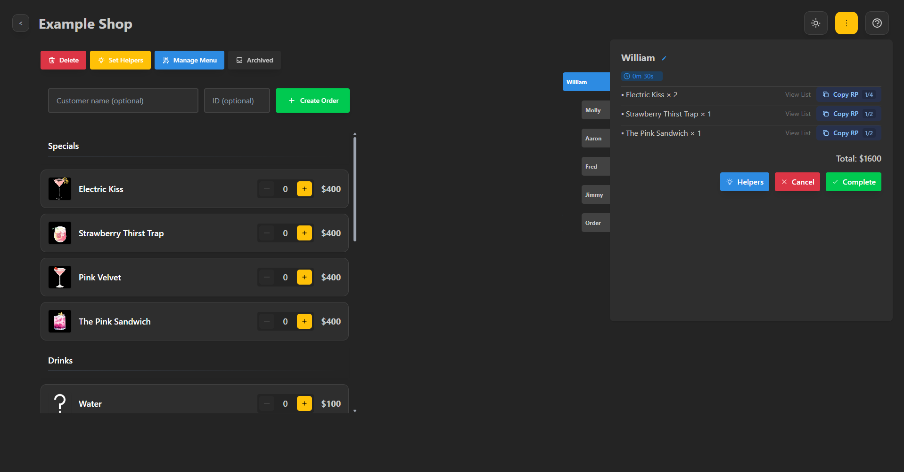
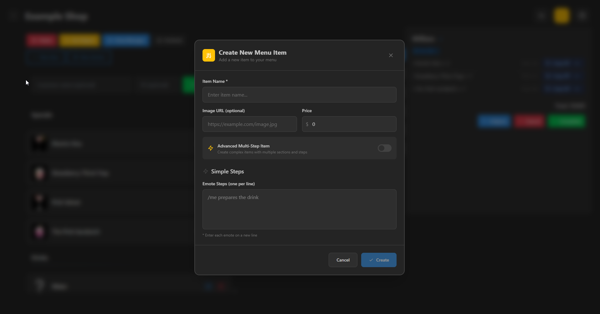
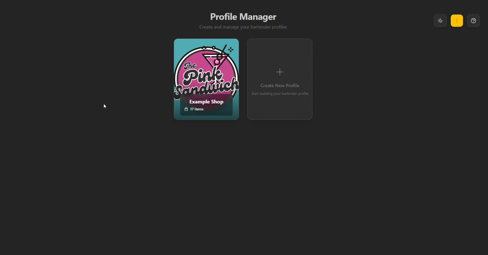

# World Bartender Tool
A streamlined digital menu and emote management tool designed specifically for bartenders, cashiers, and service workers in the GTA:W community. This application simplifies the process of managing menu items, tracking prices, and executing roleplay emotes, making customer service interactions smoother and more immersive.

Whether you're running a coffee shop, bar, restaurant, or any service business in GTA:W, this tool helps you stay organized and provide professional service while maintaining the roleplay experience your customers expect.

## The Problem
Working in service roles within GTA:W's text-based roleplay environment presents unique challenges:

- **Manual Emote Management**: Constantly typing out complex roleplay emotes for every customer interaction becomes tedious and time-consuming
- **Slow Service**: Having to manually type everything results in long wait times, especially during busy periods with multiple customers
- **Inconsistent Roleplay**: Without standardized emotes, service quality varies and may not meet the community's roleplay standards
- **Customer Experience**: Long delays and inconsistent service can frustrate customers and hurt business reputation
- **Staff Training**: New employees struggle to learn proper emotes and pricing without a centralized system

## The Solution
World Bartender Tool provides an intuitive digital interface that streamlines menu management and automates roleplay emotes, enabling service workers to deliver fast, professional, and consistent customer experiences while maintaining the immersive roleplay standards expected in the GTA:W community.

## ✨ Features
### 🎭 Professional Roleplay Enhancement
- **Pre-written Emotes**: Extensive library of professional service emotes that maintain immersion while saving time
- **Multi-step Workflows**: Complex drink preparation sequences broken down into individual emote steps
- **Customizable Actions**: Ability to edit and personalize emotes to match your character's style and establishment's atmosphere

### 🍽️ Smart Menu Management
- **Dynamic Menu System**: Create unlimited menu items with custom categories (drinks, food, specials, etc.)
- **Real-time Price Updates**: Instantly modify prices without restarting or losing data
- **Visual Menu Display**: Clean, organized interface that's easy to navigate during busy periods
- **Image Support**: Add visual references for menu items to enhance user experience

### ⚡ Efficiency & Speed
- **One-Click Service**: Execute complete service sequences with a single button press
- **Shortcuts**: Quick access to frequently used items and actions
- **Bulk Operations**: Manage multiple menu items simultaneously

### 👥 Team Collaboration
- **Import/Export**: Share menu configurations with team members
- **Standardized Training**: New staff can learn from pre-configured professional emotes
- **Consistent Service**: Ensure all employees provide the same quality experience
- **Quick Onboarding**: Get new team members productive immediately

### 🔧 Technical Features
- **Data Security**: Local storage ensures your menu data stays private
- **Performance Optimized**: Lightweight and fast, even with large menu configurations
- **Regular Updates**: Continuous improvements and new features based on community feedback

## 🌐 Access Options
### Web Version
No installation required! Access the full-featured web version instantly:

**[🚀 Launch Web App](https://gtaw-bartender.netlify.app/)**

Perfect for:
- Sharing with friends
- Trying before installing
- Cross-platform compatibility

### Desktop Application (Recommended)
For the ultimate experience, download our native desktop app:

1. Visit the [**Releases Page**](https://github.com/Vierdant/world-bartender-tool/releases)
2. Download the latest installer for your platform
3. Run the installer and follow the setup wizard

**Note**: Windows may show a security warning since we don't have a Microsoft certificate. The application is completely safe and open source.

## 🎯 How to Use
### Getting Started
1. **Launch the Application**: Open the web app or desktop version
1. **Create a Profile**: Create a profile for your business, providing a name and an image
2. **Create Your First Menu Item**: Click the "Manage Menu" button to start adding new drinks or food items
3. **Fill in the Details**: Add name, price, and optional image URL
4. **Add Emotes**: Choose between simple or advanced multi-step emote sequences
5. **Save and Test**: Save your item and create an order with it to see the emotes in action

### Basic Workflow
1. **Menu Setup**: Create categories and items that match your establishment's offerings
2. **Emote Customization**: Personalize the pre-written emotes to fit your character's style
3. **Service Delivery**: During roleplay, simply click `Copy RP` inside the order panel to execute professional service emotes

### Pro Tips
- **Start Simple**: Begin with basic drinks before creating complex multi-step items
- **Use Images**: Adding image URLs makes your menu more visually appealing and easier to navigate
- **Backup Your Data**: Use the import/export feature to save your menu configuration
- **Test Everything**: Preview all emotes before using them in actual roleplay scenarios
- **Customize Freely**: Edit any emote text to match your character's personality and speaking style
- **Utilize Variables**: Use replaceable variables like `!name` and `!id` in your emotes to enhance them further

## 📄 License
This project is licensed under the MIT License - see the [LICENSE](LICENSE) file for details.

## 🤝 Contributing
### 🐛 Bug Reports & Feature Requests
- Open an [issue](https://github.com/Vierdant/world-bartender-tool/issues) with detailed information
- Include steps to reproduce for bugs
- Check existing issues before creating new ones
- Alternativly, you can join our [Discord Server](https://discord.com/invite/cnknQJDBer) and submit issues there <3

### 💻 Code Contributions
1. Fork the repository
2. Create a feature branch: `git checkout -b feature/amazing-feature`
3. Make your changes and test thoroughly
4. Commit with descriptive messages: `git commit -m 'Add amazing feature'`
5. Push to your branch: `git push origin feature/amazing-feature`
6. Open a pull request with a clear description

## ⚠️ Disclaimer
- **Vierdant/[Locker](https://forum.gta.world/en/profile/104259-locker/)** is not affiliated with Rockstar Games, GTA-related projects, or GTA:W development teams
- This application was created independently in spare time for the community
- Animation preview images are used for visual context and identification purposes only
- All trademarks belong to their respective owners

---

  <strong>Made with ❤️ for the GTA:W Community</strong> 
  <a href="https://gtaw-bartender.netlify.app/">Try the Web App</a> • 
  <a href="https://github.com/Vierdant/world-bartender-tool/issues">Report Issues</a> • 
  <a href="https://github.com/Vierdant/world-bartender-tool/releases">Download Desktop App</a>

